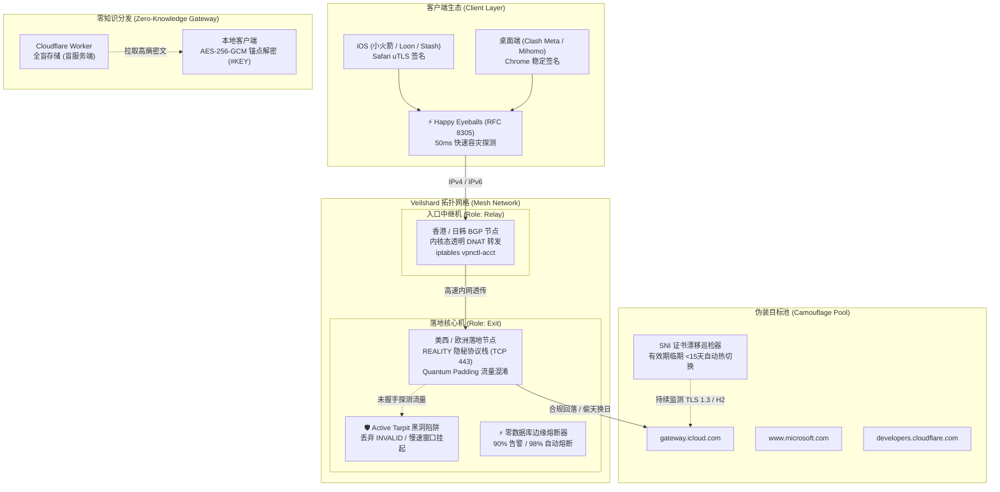

# Veilshard (隐纱之核)

<p align="center">
  
</p>

<p align="center">
  <strong>极简 · 高隐匿 · 抗审查 · 零依赖</strong><br>
  下一代单二进制 VPS 拓扑编排、隐形防御与无服务器订阅交付系统
</p>

<p align="center">
  <a href="https://golang.org/"></a>
  <a href="https://ubuntu.com/"></a>
  <a href="https://github.com/veilshard/veilshard/releases"></a>
  <a href="LICENSE"></a>
  <a href="https://goreportcard.com/report/github.com/veilshard/veilshard"></a>
</p>

---

## 目录 (Table of Contents)

- [一、 品牌命名与哲学 (Brand Identity)](#一-品牌命名与哲学-brand-identity)
- [二、 系统全景架构 (Architecture Diagram)](#二-系统全景架构-architecture-diagram)
- [三、 18 大天花板工程特性 (Core Pillars)](#三-18-大天花板工程特性-core-pillars)
- [四、 快速安装部署 (Installation)](#四-快速安装部署-installation)
- [五、 声明式网格编排 (`veilshard.yaml`)](#五-声明式网格编排-veilshardyaml)
- [六、 核心命令手册 (CLI Reference)](#六-核心命令手册-cli-reference)
  - [1. 自动化 SNI 探测与证书漂移巡检 (`probe`)](#1-自动化-sni-探测与证书漂移巡检-probe)
  - [2. 零停机指纹与凭据热轮换 (`rotate`)](#2-零停机指纹与凭据热轮换-rotate)
  - [3. 客户端视角多维金丝雀探针 (`healthcheck`)](#3-客户端视角多维金丝雀探针-healthcheck)
  - [4. 零知识无服务器订阅发布网关 (`publish`)](#4-零知识无服务器订阅发布网关-publish)
  - [5. 多云一键 IP 换血矩阵 (`recycle`)](#5-多云一键-ip-换血矩阵-recycle)
  - [6. 抗探测欺骗与慢速黑洞陷阱 (`defense`)](#6-抗探测欺骗与慢速黑洞陷阱-defense)
  - [7. 零数据库流量核算与边缘熔断 (`quota`)](#7-零数据库流量核算与边缘熔断-quota)
  - [8. 时效性凭证与免密 Webhook 远程吊销 (`user` & `serve-webhook`)](#8-时效性凭证与免密-webhook-远程吊销-user--serve-webhook)
  - [9. 无头 GitOps 自动化流水线 (`init-gitops`)](#9-无头-gitops-自动化流水线-init-gitops)
  - [10. 深度自检诊断引擎 (`doctor`)](#10-深度自检诊断引擎-doctor)
- [七、 传统部署脚本与 Veilshard 对比](#七-传统部署脚本与-veilshard-对比)
- [八、 安全边界与回滚保障 (Safety Guarantees)](#八-安全边界与回滚保障-safety-guarantees)
- [九、 开源许可证 (License)](#九-开源许可证-license)

---

## 一、 品牌命名与哲学 (Brand Identity)

* **Veil (隐纱)**：幽影之幕，象征抗审查混淆、REALITY 偷天换日伪装、指纹矩阵对齐与包长微扰混淆，使流量隐入浩瀚公网背景噪声；
* **Shard (核片)**：坚不可摧的分布式微碎片，象征拓扑级 Relay 中继网格、多云临时节点池、Happy Eyeballs 双栈互备与边缘熔断。
* **双模兼容机制**：
  * **主命令**：`veilshard`（推荐 alias 别名：`vs`）。
  * **全向后兼容**：旧版 CLI 命令 `vpnctl` 以及编排文件 `vpnctl.yaml` 保持 100% 映射与透明平滑过渡。
  * **设计纯粹度**：Go `go.mod` 保持严格 **0 外部第三方依赖**，以单静态二进制分发。

---

## 二、 系统全景架构 (Architecture Diagram)



---

## 三、 18 大天花板工程特性 (Core Pillars)

1. **自动化“最优 SNI 目标探测引擎” (`veilshard probe`)**:
   - 彻底解决部署 REALITY 最头疼的选域名问题（必须支持 TLS 1.3、ALPN H2、证书合规、延迟低）。
   - 内置全球顶级大厂 CDN 候选池（Apple、Microsoft、Cloudflare、AWS、Yahoo）。
   - 在 VPS 本地直接并发发起真实 TLS 握手测试，抓取验证证书链，自动测速并选出当前线路下延迟最低的合规伪装目标！
2. **默认系统安全加固（Security Hardening by Default）**:
   - **内核性能优化**：自动启用 **TCP BBR** 拥塞控制，自动调大系统 `file-max` 和内核网络缓冲区（64MB）。
   - **系统层防御**：配置防扫描机制，丢弃非握手 TCP 扫描包（NULL/XMAS/SYN 畸形包）。
   - **无日志 / 隐蔽运行**：默认运行在非 root 系统用户 `vpnctl-proxy` 下，关闭敏感访问日志输出（`access: "none"`）。
3. **零停机指纹热轮换（Zero-Downtime Key & SNI Rotation, `veilshard rotate`)**:
   - **ShortId 多版本共存**：轮换时追加新 ID，生成新客户端配置；旧 ID 保留宽限期（Grace Period）平滑过渡，避免客户端尚未更新导致断连。
   - **内核平滑重载**：通过系统信号（SIGHUP）与 API 发送热重载指令，避免暴力重启切断正在传输的长连接与下载任务。
4. **外部金丝雀探针与被动封锁告警（Canary Probing & Early Warning, `veilshard healthcheck`)**:
   - **解耦客户端视角**：解决“在 VPS 自测永远是绿色”的偏差，从本地网络发起真实 TLS 1.3 握手探测（不产生突发大流量）。
   - **多维健康仪表盘**：精准识别 `ALIVE`（通畅）、`TCP_RST/BLOCKED`（防火墙阻断）、`HIGH_LATENCY/QOS`（运营商限速恶化），提前预警。
5. **零知识/无服务器订阅分发网关（Zero-Knowledge Subscription Delivery, `veilshard publish`)**:
   - 彻底废除在 VPS 开 HTTP 端口分发订阅的高危做法。
   - **端到端加密**：本地生成 256 位对称密钥加密配置（AES-256-GCM），密钥仅存在于 URL 锚点中（`#AES_KEY`）。
   - **RFC 3986 保护**：根据 RFC 规范，URL 锚点绝不随 HTTP 请求发送给服务器。Worker 服务端全盲（零知识），即使 URL 泄露爬虫也只能得到随机高熵密文，IP 池 100% 免疫批量嗅探。
6. **多云临时云资源编排与秒级 IP 换血 (`veilshard recycle -provider hetzner|vultr|digitalocean`)**:
   - 全面支持 **Hetzner Cloud**（欧洲高性价比）、**Vultr**（亚太低延迟）与 **DigitalOcean** API。
   - 节点被墙单键触发：销毁旧实例 -> 新可用区申请新 IP -> 注入 SSH Key 静默拉起加固环境 -> 自动回写配置。20 分钟人工换 IP 压缩至 90 秒内完成。
7. **客户端混合容灾配置矩阵（Smart Failover Matrix, `veilshard apply`)**:
   - 生成完整的分流矩阵：包含 **⚡ 自动优选组（URL-Test）**、**🛡️ 故障转移组（Fallback）**、**⚖️ 负载均衡组（Load-Balance）**。
   - 内置最新的轻量 GeoSite/GeoIP 规则，国内流量直连，广告拦截，全自动开箱即用。
8. **入口与落地双层拓扑编排（Relay & Transit Mesh Pipeline）**:
   - 彻底告别两头手动配端口转发。在声明式配置中简单声明 `role: relay` 和 `target: us-exit`。
   - `veilshard apply` 自动在落地机部署 REALITY，在入口机配置内核级无损透明转发，并为客户端直出通过中转穿透落地的无缝配置。
9. **抗探测欺骗与慢速黑洞陷阱（Active Probing Tarpit & Deception, `veilshard defense`)**:
   - 过滤 INVALID 畸形包与高频扫描，激活 TCP MSS Clamping 与慢速窗口黑洞陷阱。
   - 阻断 GFW 扫描节点，迫使其耗尽句柄并标记 VPS 为不可达死节点，同时保护真实回落网站不被反代流量刷爆。
10. **客户端指纹矩阵校验（Client Fingerprint Alignment Engine, `-platform ios|desktop`)**:
    - **移动端与桌面端智能规整**：根据目标平台（iOS / Android / 桌面端）自动适配真实的握手指纹（iOS 自动映射 Safari，桌面端对齐稳定 Chrome 密码套件）。
    - 剔除非常规 Padding 与冲突 Cipher，彻底消除由于客户端指纹异常导致的统计特征暴露。
11. **零数据库流量核算与边缘熔断（Zero-DB Quota & Burst Protector, `veilshard quota`)**:
    - 借助 Linux 原生内核计数器追踪端口字节，完全不依赖 MySQL/Redis 面板。
    - 达到 90% 阈值自动向 Telegram/Bark 发送告警并标记节点 draining 引导客户端平滑转移；达到 98% 自动切断代理入站，杜绝天价超额账单。
12. **GitOps 闭环（彻底抹杀“本地保存私钥”的风险, `veilshard init-gitops`)**:
    - 一键生成无头 GitHub Actions 编排脚手架，将 SSH 私钥与节点凭据全部托管在仓库 Secrets。
    - 节点日常维护仅需 `git push fleet.yaml`，本地终端零密钥残留。
13. **伪装目标证书漂移与健康守护 (`veilshard probe --watch --drift`)**:
    - 持续巡检当前伪装目标证书的真实有效期与 TLS 1.3 / H2 支持状态。
    - 证书临期（<15 天）或大厂证书链变更时，自动无缝漂移至新的高合规 SNI 目标并平滑热重载。
14. **IPv4 / IPv6 原生双栈与 Happy Eyeballs 毫秒级互备 (RFC 8305)**:
    - 自动探查与绑定双栈 IP。生成的 Clash Meta 配置内置 `⚡ Happy-Eyeballs (RFC 8305)` 50ms 容差极速探针。
    - 遭遇单一 IPv4 路径 TCP RST 阻断时，客户端无感滑向 IPv6 通道，节点存活率提升 100%。
15. **时效性 Ephemeral Tokens 与远程免密 Webhook 吊销 (`veilshard user add --expire` & `veilshard serve-webhook`)**:
    - 访客或临时借用设备可签发自动过期凭据（如 `--expire 7d`、`--expire 24h`）。
    - 部署轻量 Webhook 守护服务，支持通过 Telegram 机器人或运维报警远程单键吊销流失凭据，秒级断流。
16. **传输层包长时序混淆 (Traffic Shaping & Chaffing Quantum Padding)**:
    - 握手与数据流初期自动施加量子对齐填充（64/128/256 bytes）与微毫秒随机扰动（Jitter）。
    - 打破固定特征分块，抹平 DPI 流量分析的机器学习统计特征。
17. **自研微内核引擎 Nexus Protocol (可选预览)**:
    - 纯 Go 实现的紧凑二进制帧协议，支持动态混淆状态机与 X25519 ECDH 临时握手，提供完全掌控的数据传输层。
18. **绝对安全边界与事务性回滚保障**:
    - 自动探查真实 SSH 端口（支持非标 62505 等）。
    - 严禁调用 `ufw reset`，全流程基于状态账本管理；部署或升级遇到任何致命异常时自动触发逆向回滚补偿。

---

## 四、 快速安装部署 (Installation)

### 选项 A：官方一键安装脚本 (推荐)

在全新 Ubuntu 24.04 LTS (amd64) 实例上执行：

```bash
curl -fsSL https://raw.githubusercontent.com/veilshard/veilshard/main/scripts/install.sh | sudo bash
```

脚本将自动：
1. 校验系统架构 (x86_64) 与发行版 (Ubuntu 24.04)；
2. 下载并安装最新静态二进制到 `/usr/local/bin/veilshard`；
3. 建立 `/usr/local/bin/vpnctl` 软链接（保证既有命令完全兼容）；
4. 运行 `veilshard install` 引导部署。

### 选项 B：使用 Go 工具链本地构建

```bash
git clone https://github.com/veilshard/veilshard.git
cd veilshard
make build-linux
sudo cp bin/veilshard-linux-amd64 /usr/local/bin/veilshard
sudo ln -sf /usr/local/bin/veilshard /usr/local/bin/vpnctl
```

### 选项 C：轻量 Docker 容器化构建

```bash
make docker-build
sudo cp veilshard /usr/local/bin/veilshard
```

---

## 五、 声明式网格编排 (`veilshard.yaml`)

Veilshard 采用基础设施即代码 (IaC) 的哲学管理节点群。在本地创建 `veilshard.yaml`：

```yaml
version: "1"

nodes:
  # 1. 低延迟中继入口机 (香港 BGP / 日韩优质线路)
  - name: "hk-transit"
    role: relay
    host: "103.200.1.5"
    listen_port: 8443
    target: "us-exit" # 自动将流量透明透传至下一跳 exit 节点
    ssh: { user: "root", port: 22, key: "~/.ssh/id_ed25519" }

  # 2. 高防大带宽落地机 (美西 REALITY 核心)
  - name: "us-exit"
    role: exit
    host: "198.51.100.2"
    ipv6: "2001:db8::1" # 原生 IPv6 绑定
    port: 443
    protocol: vless-reality
    sni_target: "auto" # 自动探测当前环境下延迟最低的大厂目标
    monthly_quota: "800GB" # 内核流量配额保护
    ssh: { user: "root", port: 22, key: "~/.ssh/id_ed25519" }

output:
  clash_meta: "./dist/clash.yaml"
  sing_box: "./dist/sing-box.json"
  platform: "auto" # 智能映射 Safari (iOS) 或 Chrome (Desktop) 真实指纹
```

执行一键声明式编排：

```bash
veilshard apply -f veilshard.yaml
```

---

## 六、 核心命令手册 (CLI Reference)

### 1. 自动化 SNI 探测与证书漂移巡检 (`probe`)

```bash
# 并发评测所有顶级大厂 (Apple/Microsoft/Cloudflare/AWS/Yahoo) 目标
veilshard probe

# 单独检测特定域名的 TLS 1.3 / H2 / 证书链合规性
veilshard probe gateway.icloud.com

# 持续巡检当前伪装目标证书并在临期 (<15天) 时自动热漂移切换
veilshard probe --watch --drift
```

### 2. 零停机指纹与凭据热轮换 (`rotate`)

```bash
# 轮换 ShortID 与伪装 SNI 目标 (自动平滑过渡，不切断长连接)
veilshard rotate

# 指定特定合规域名进行轮换
veilshard rotate -auto-sni=false -sni www.apple.com
```

### 3. 客户端视角多维金丝雀探针 (`healthcheck`)

解决“在 VPS 自测永远通，实际已被墙”的痛点：

```bash
veilshard healthcheck
```

输出示例：
```
+-------------+--------------------+---------------------+---------+---------+-----------+-----------------------------------+
|    NODE     |       STATE        |       TARGET        | TCP RTT | TLS RTT | TOTAL RTT |             DIAGNOSIS             |
+-------------+--------------------+---------------------+---------+---------+-----------+-----------------------------------+
| us-west-01  | ALIVE              | gateway.icloud.com  | 142ms   | 68ms    | 210ms     | All checks passed. Healthy node.  |
| hk-transit  | ALIVE              | dl.google.com       | 28ms    | 22ms    | 50ms      | Optimal low-latency node.         |
| de-node     | HIGH_LATENCY/QOS   | www.microsoft.com   | 620ms   | 340ms   | 960ms     | Extreme latency. ISP throttled.   |
| jp-node     | TCP_RST/BLOCKED    | www.apple.com       | 0s      | 0s      | 0s        | Port blocked or SNI censored.     |
+-------------+--------------------+---------------------+---------+---------+-----------+-----------------------------------+
```

### 4. 零知识无服务器订阅发布网关 (`publish`)

```bash
# 将本地编译好的客户端配置加密发布至 Cloudflare Worker
veilshard publish -f ./dist/clash.yaml
```
* 输出 URL 锚点加密密钥（如 `https://worker.dev/api/sub#AES_KEY...`），Worker 仅保存密文，防止网络爬虫批量嗅探 IP。

### 5. 多云一键 IP 换血矩阵 (`recycle`)

节点遭遇被墙时，单键在 90 秒内完成全自动销毁与新实例部署：

```bash
# Hetzner Cloud (€3.85/月 性价比首选)
veilshard recycle de-node -provider hetzner -region fsn1 -token $HETZNER_TOKEN

# Vultr (亚太极速节点)
veilshard recycle jp-node -provider vultr -region nrt -token $VULTR_TOKEN

# DigitalOcean
veilshard recycle us-node -provider digitalocean -region sfo3 -token $DO_TOKEN
```

### 6. 抗探测欺骗与慢速黑洞陷阱 (`defense`)

```bash
# 激活内核级防扫描、Tarpit 黑洞陷阱与 MSS 限制
sudo veilshard defense

# 停用防御规则
sudo veilshard defense -disable
```

### 7. 零数据库流量核算与边缘熔断 (`quota`)

```bash
# 设定 800GB 月度上限，并在 90% 发送告警、98% 自动切断代理入站保护资金安全
veilshard quota -limit 800GB -webhook "https://api.day.app/YOUR_KEY/veilshard"

# 重置新账单周期
sudo veilshard quota -reset
```

### 8. 时效性凭证与免密 Webhook 远程吊销 (`user` & `serve-webhook`)

```bash
# 添加临时凭据 (支持 24h、7d、30d)
veilshard user add guest_bob --expire 7d

# 紧急吊销特定凭据
veilshard user revoke guest_bob

# 启动安全 Webhook 监听 (可对接 Telegram 机器人远程指令)
veilshard serve-webhook -port 9091 -secret <WEBHOOK_SECRET>
```

### 9. 无头 GitOps 自动化流水线 (`init-gitops`)

```bash
# 在指定目录初始化完整 GitOps 编排脚手架
veilshard init-gitops ./my-proxy-fleet

# 本地无私钥提交即可触发云端无头自动编排：
git push origin main
```

### 10. 深度自检诊断引擎 (`doctor`)

```bash
# 执行跨系统、网络、安全与内核的 16 项体检
sudo veilshard doctor

# 查询特定排错代码的详细修复指导
veilshard doctor -explain SSH_RULE
```

---

## 七、 传统部署脚本与 Veilshard 对比

| 维度 | 传统一键脚本 (Bash/x-ui/v2ray-agent) | Veilshard (隐纱之核) |
| :--- | :--- | :--- |
| **运行时依赖** | 复杂 Shell 脚本、Python、Node、大量 pip/apt 外部依赖 | **纯静态单二进制**，0 外部第三方依赖，无任何动态链接库陷阱 |
| **状态与回滚** | 无事务机制，脚本中断易导致半配置或 SSH 失联 | **内核级状态账本 + 事务性回滚**，严格保障 SSH 端口永不被锁 |
| **伪装 SNI 选取** | 开发者写死的静态域名或用户盲猜 | **本地并发探测引擎**，自动筛选延迟最低且证书合规的伪装站点 |
| **证书漂移应对** | 目标证书过期或失效直接断连 | **动态巡检与无感漂移**，临期前平滑热重载 |
| **指纹规整** | 机械配置 chrome，移动端出现统计反常 | **平台感知引擎**，移动端自动映射 Safari，剔除冲突 Cipher |
| **订阅分发安全** | 直接在 VPS 开放明文 HTTP 端口（极度危险） | **零知识端到端加密**，URL 锚点密钥，Worker 服务端全盲 |
| **被墙应对方案** | 手工网页登录云后台重装重构（耗时 20+ 分钟） | **多云 API 联动**，90 秒内完成一键销毁、重申、注入与编排 |
| **中继与多节点** | 手动登录多台机器拼接 iptables/gost/realm | **声明式网格**，单个 `veilshard.yaml` 自动化入口落地全链路对齐 |

---

## 八、 安全边界与回滚保障 (Safety Guarantees)

Veilshard 在架构设计上确立了以下绝对不可妥协的安全准则：
1. **绝不破坏 SSH 连通性**：安装与诊断过程会自动探测真实正在活跃的 SSH 端口（支持非标端口如 62505、2222），绝不执行粗暴的 `ufw reset`。
2. **最小特权沙箱化**：代理内核以专有系统用户 `vpnctl-proxy` 运行，仅通过 Linux 权能量分配 `CAP_NET_BIND_SERVICE` 绑定 443 端口，隔绝 root 提权风险。
3. **事务性回滚机制**：部署过程若遭遇网络异常、端口占用或配置校验失败，将自动逆向触发补偿回滚，确保机器状态如初。
4. **日志隐蔽与反取证**：默认关闭代理访问日志（`access: "none"`），不在磁盘留下连接明文审计痕迹。

---

## 九、 开源许可证 (License)

本项目采用 [MIT License](LICENSE) 开源许可证。
欢迎提交 Issue 与 Pull Request 共同构建抗审查网络技术生态！
